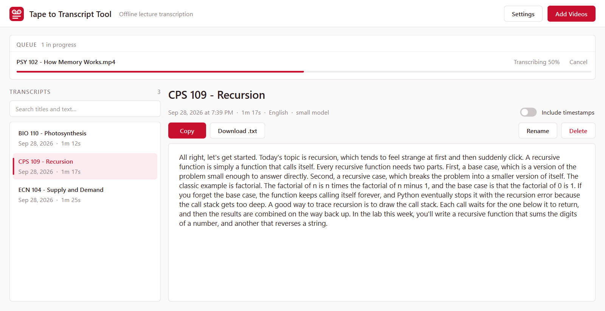

# Tape to Transcript Tool

**Turn recorded lectures into clean, searchable transcripts, entirely offline.**

Tape to Transcript Tool is a Windows desktop app for the week before an exam, when
you have six hours of lecture recordings and no time to rewatch them. Drop in the
videos and it transcribes them one after another with a local
[Whisper](https://github.com/openai/whisper) speech model, saves every transcript,
and lets you search, copy, or export the text. Nothing is uploaded: after a
one-time model download it works with no internet at all.



<details>
<summary>Timestamps view</summary>

![A transcript with [HH:MM:SS] timestamps on every line](docs/screenshot-timestamps.png)

</details>

---

## The problem

Lecture recordings are great until you need to find something in them. Scrubbing
through a 50-minute video for the two minutes where the professor defined a term is
slow, and most transcription services want an account, an upload, and a monthly
fee, which isn't great for recordings you may not be allowed to share.

Tape to Transcript Tool keeps everything on your machine and turns a folder of
videos into text you can skim, search, and quote in your notes.

## Features

- **Batch queue**: add as many videos or audio files as you like (mp4, mkv, mov, webm, avi, m4a, mp3, wav). They transcribe one at a time in the background with a live progress bar. Cancel the current file or remove queued ones at any point.
- **Fully offline**: a local Whisper model via [faster-whisper](https://github.com/SYSTRAN/faster-whisper). Your recordings never leave your computer. No FFmpeg install needed.
- **Saved and searchable**: every transcript is stored automatically. Search across titles *and* full text to find the lecture where something came up.
- **Copy or download**: copy a transcript to the clipboard in one click, or save it as a `.txt` file.
- **Timestamps on demand**: toggle `[HH:MM:SS]` timestamps per line at any time, even for transcripts made earlier.
- **Skips the silence**: voice-activity detection skips pauses, which is faster and helps avoid made-up text during silence.
- **Uses your GPU if it can**: an NVIDIA GPU is used automatically when available; if anything goes wrong it falls back to the CPU and keeps going.
- **Drag and drop**: drop files onto the window, or onto the `.exe` itself.

## Install (Windows 10/11)

**Download page: [tapetotranscript.vercel.app](https://tapetotranscript.vercel.app/)**

No Python, no terminal. Just download and run. Grab a build from the download page
above or straight from the
[**Releases**](https://github.com/JasimSiddiqui/tape-to-transcript-tool/releases/latest) page:

| | What it does |
| --- | --- |
| **[`TapeToTranscriptTool-Setup.exe`](https://github.com/JasimSiddiqui/tape-to-transcript-tool/releases/latest/download/TapeToTranscriptTool-Setup.exe)** (recommended, ~90 MB) | Double-click to install. Installs per-user (no admin prompt), puts a **Tape to Transcript Tool** shortcut on your desktop, and adds an uninstall entry to Add/Remove Programs. |
| **[`TapeToTranscriptTool-Portable.zip`](https://github.com/JasimSiddiqui/tape-to-transcript-tool/releases/latest/download/TapeToTranscriptTool-Portable.zip)** (~130 MB) | Unzip anywhere and run `TapeToTranscriptTool.exe`; nothing is installed. Keep the whole folder together. |

**First launch:** the app isn't code-signed yet, so Windows SmartScreen shows
*"Windows protected your PC."* Click **More info → Run anyway**. You only see
this once.

**First transcription:** the speech model is downloaded the first time you use it
(about 485 MB for the default size). After that the app works fully offline.

## Choosing a model

Pick the model size in **Settings**. Each size is downloaded once, the first time
you use it.

| Model | Download | Notes |
| --- | --- | --- |
| `tiny` | ~75 MB | Fastest, least accurate |
| `base` | ~145 MB | |
| `small` | ~485 MB | **Default**, a good balance |
| `medium` | ~1.5 GB | Slower, more accurate |
| `large-v3` | ~3 GB | Slowest, most accurate; a GPU is recommended |

Speed depends on your hardware. As a reference point, `small` on a laptop CPU
transcribed a 46-second clip in about 6 seconds. Larger models are several times
slower.

Settings also let you choose the **language** (auto-detect or English) and the
**device** (Auto, CPU, or GPU).

## Using an NVIDIA GPU

With **Device** set to *Auto*, the app uses an NVIDIA GPU when one is found **and**
its CUDA libraries are available, otherwise the CPU. If the GPU fails for any reason,
the app switches to the CPU automatically and shows a notice.

The GPU needs a recent NVIDIA driver plus these libraries:

- **cuBLAS for CUDA 12**: `cublas64_12.dll`, `cublasLt64_12.dll`
- **cuDNN 9 for CUDA 12**: `cudnn_ops64_9.dll`, `cudnn_cnn64_9.dll`, and the other `cudnn*64_9.dll` files

Either install the [CUDA Toolkit 12](https://developer.nvidia.com/cuda-downloads) and
[cuDNN 9](https://developer.nvidia.com/cudnn-downloads) and make sure their `bin`
folders are on your `PATH`, or put the DLLs next to `TapeToTranscriptTool.exe`
(prebuilt copies are available from
[Purfview/whisper-standalone-win](https://github.com/Purfview/whisper-standalone-win/releases/tag/libs)).
Restart the app afterwards. The Settings dialog shows whether a GPU was detected.

## Where your data lives

Everything is stored in `%APPDATA%\TapeToTranscriptTool\` (Settings has an
**Open data folder** link):

| Path | Contents |
| --- | --- |
| `transcripts.db` | SQLite database of transcripts and their timestamped segments |
| `settings.json` | Your settings |
| `models\` | Downloaded speech models, one folder per size |
| `app.log` | Rotating log file, useful if something goes wrong |

To start fresh, close the app and delete the folder. To free disk space, delete
model folders you no longer use; they're downloaded again if needed.

## Build from source

You'll need Windows 10/11 and [Python](https://www.python.org/downloads/) 3.11, 3.12,
or 3.13.

```bat
git clone https://github.com/JasimSiddiqui/tape-to-transcript-tool.git
cd tape-to-transcript-tool

rem Create .venv, install requirements, and build dist\TapeToTranscriptTool\
build.bat

rem Or run straight from source (after build.bat has created .venv)
.venv\Scripts\python.exe main.py
```

`build.bat` produces `dist\TapeToTranscriptTool\TapeToTranscriptTool.exe`, a
one-folder, windowed build. To make the installer, install
[Inno Setup 6](https://jrsoftware.org/isinfo.php) (`winget install JRSoftware.InnoSetup`)
and run `package.bat`; it builds `dist\TapeToTranscriptTool-Setup.exe` from
[`installer.iss`](installer.iss) and `dist\TapeToTranscriptTool-Portable.zip`.

## How it works

Tape to Transcript Tool is a [PySide6](https://doc.qt.io/qtforpython-6/) (Qt)
desktop app around [faster-whisper](https://github.com/SYSTRAN/faster-whisper),
packaged with [PyInstaller](https://pyinstaller.org).

- The **worker** ([`app/transcriber.py`](app/transcriber.py)) runs in its own
  `QThread` and handles one file at a time. It checks the file with PyAV, downloads
  the model on first use (in a background thread, so a cancel never waits on a
  multi-gigabyte download), picks CPU or GPU, and streams segments back to the UI
  as they're decoded. Progress is each segment's end time over the file's duration.
  Cancelling is checked between segments.
- **GPU fallback** happens in three places: before loading (are the CUDA DLLs
  loadable?), while loading the model, and during transcription. Any failure
  switches to CPU/int8 for the rest of the session and shows a notice instead of an
  error.
- The **UI** ([`app/ui/`](app/ui/)) never blocks: it only sends jobs and receives
  signals. Finished transcripts are written to SQLite
  ([`app/database.py`](app/database.py)) as timestamped segments, so plain and
  timestamped text are both generated on the fly
  ([`app/formatting.py`](app/formatting.py)).
- The **logo** and every other graphic are drawn in code
  ([`app/ui/logo.py`](app/ui/logo.py)); the same drawing is rendered into the
  `.exe` icon at build time.

## Tech stack

- **[faster-whisper](https://github.com/SYSTRAN/faster-whisper)** / CTranslate2: Whisper inference on CPU or GPU
- **[PyAV](https://github.com/PyAV-Org/PyAV)**: audio and video decoding (bundles FFmpeg)
- **[PySide6](https://doc.qt.io/qtforpython-6/)**: the desktop UI
- **SQLite**: transcript storage
- **[PyInstaller](https://pyinstaller.org)** and **[Inno Setup](https://jrsoftware.org/isinfo.php)**: packaging

## Known limitations

- Cancel takes effect between chunks of audio, usually within a few seconds. While
  a long file is first being decoded, cancel waits until decoding finishes.
- Plain-text transcripts start a new paragraph about once a minute, at a sentence
  end, rather than by topic.
- A file's audio is decoded into memory in full (about 230 MB per hour of audio).
- Windows only for now.

## License

Copyright (C) 2026 Jasim Siddiqui.

Tape to Transcript Tool is free software, released under the **GNU General Public
License v3.0**. You may use, study, share, and modify it; if you distribute a
modified version, that version must also be open source under the GPL. There is
no warranty. See [LICENSE](LICENSE) for the full text.
